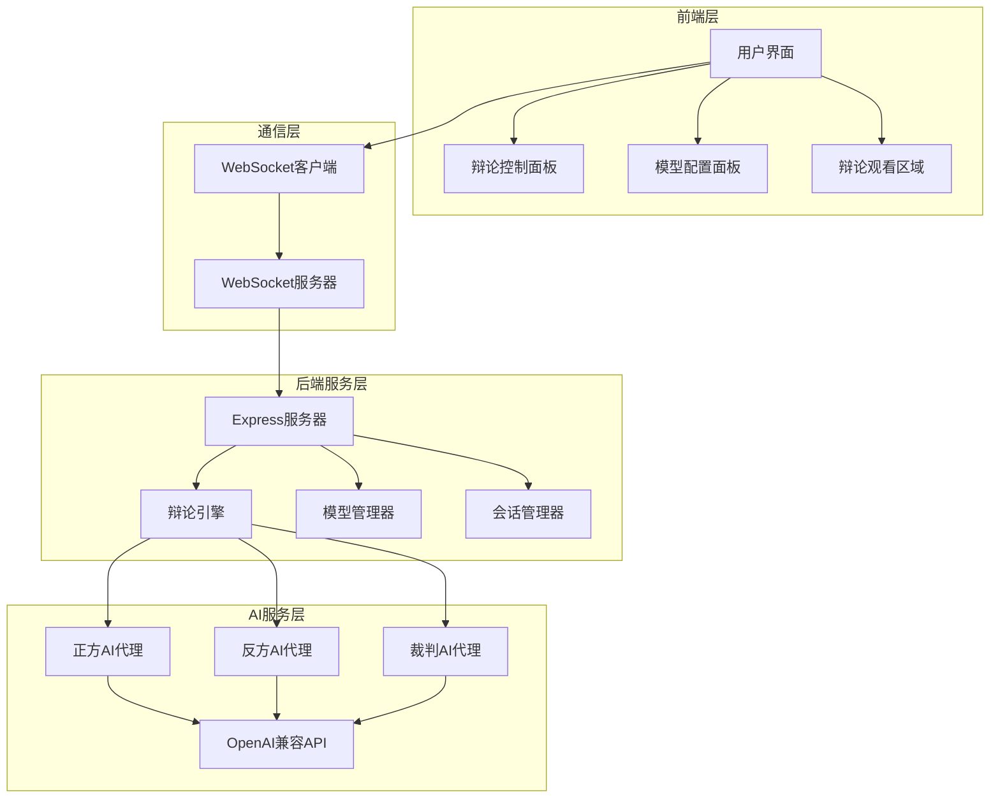
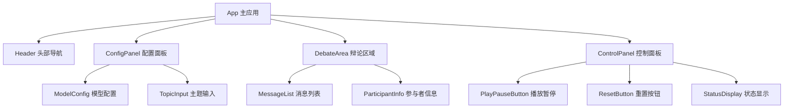
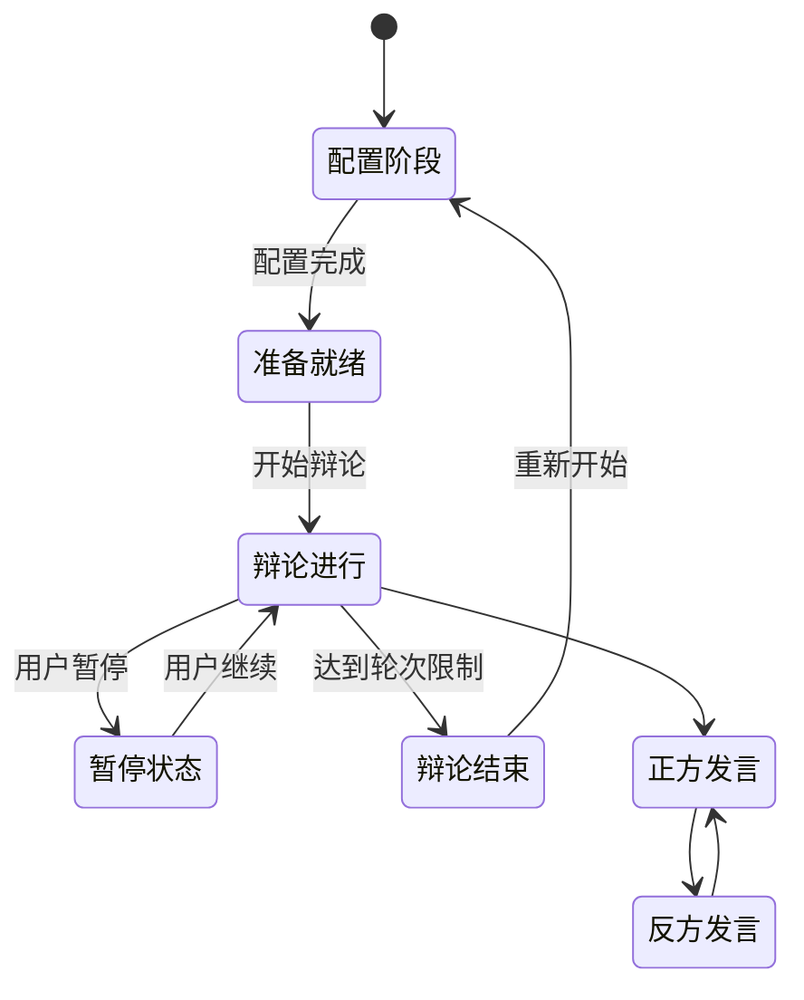
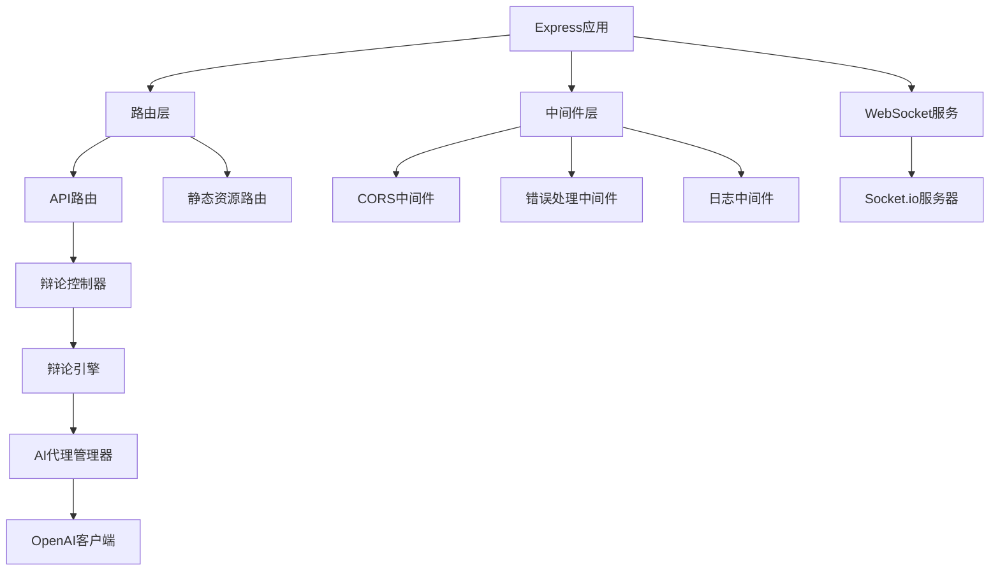
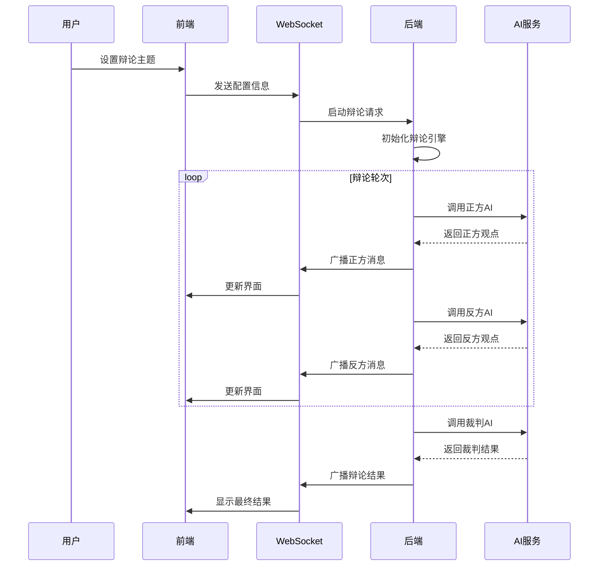
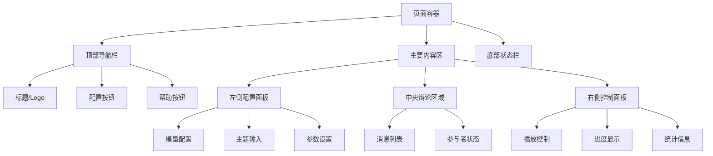

# AI辩论平台设计文档

## 1. 项目概述

AI辩论平台是一个基于Web的应用程序，允许用户创建辩论主题，并观看两个AI模型进行正反方辩论。平台支持用户自定义AI模型配置，实时控制辩论进程，并提供流畅的观看体验。

### 1.1 核心功能
- 支持正反方AI辩论，角色明确
- 兼容OpenAI API的多模型配置
- 实时辩论进程控制（暂停/继续）
- 用户友好的辩论观看界面
- 灵活的模型配置（正方、反方、裁判）

### 1.2 技术选型
- **前端**: 原生HTML5 + CSS3 + JavaScript (ES6+)
- **后端**: Node.js + Express
- **AI集成**: OpenAI兼容API
- **实时通信**: WebSocket (Socket.io)
- **数据存储**: 内存存储 + 可选文件持久化

## 2. 系统架构

### 2.1 整体架构图



### 2.2 系统分层

| 层级 | 组件 | 职责 |
|------|------|------|
| 表现层 | 原生前端界面 | 用户交互、辩论展示、控制面板 |
| 通信层 | WebSocket | 实时双向通信、状态同步 |
| 业务层 | 辩论引擎 | 辩论逻辑、轮次管理、状态控制 |
| 服务层 | AI代理管理 | 模型调用、响应处理、错误处理 |
| 接口层 | OpenAI API | 外部AI服务集成 |

## 3. 前端架构

### 3.1 组件结构



### 3.2 前端模块定义

#### 3.2.1 主应用模块 (App)
```javascript
// 应用状态管理
const AppState = {
    debate: {
        topic: '',
        status: 'idle', // idle, running, paused, finished
        messages: [],
        currentTurn: 'positive'
    },
    config: {
        models: {
            positive: { name: '', apiKey: '', baseUrl: '' },
            negative: { name: '', apiKey: '', baseUrl: '' },
            judge: { name: '', apiKey: '', baseUrl: '' }
        }
    },
    ui: {
        isConfigVisible: false,
        isLoading: false
    }
};
```

#### 3.2.2 配置面板模块 (ConfigPanel)
```javascript
// 模型配置结构
const ModelConfiguration = {
    positive: {
        name: 'gpt-3.5-turbo',
        apiKey: 'sk-xxxxx',
        baseUrl: 'https://api.openai.com/v1',
        systemPrompt: '你是正方辩手，需要为你的观点进行有力论证...'
    },
    negative: {
        name: 'gpt-3.5-turbo', 
        apiKey: 'sk-xxxxx',
        baseUrl: 'https://api.openai.com/v1',
        systemPrompt: '你是反方辩手，需要反驳正方观点并提出你的论据...'
    },
    judge: {
        name: 'gpt-4',
        apiKey: 'sk-xxxxx', 
        baseUrl: 'https://api.openai.com/v1',
        systemPrompt: '你是辩论裁判，需要客观评价双方表现...'
    }
};
```

#### 3.2.3 辩论区域模块 (DebateArea)
```javascript
// 消息结构定义
const MessageStructure = {
    id: 'unique-id',
    role: 'positive|negative|judge|system',
    content: '发言内容',
    timestamp: '2024-01-01T00:00:00Z',
    metadata: {
        model: '使用的模型名称',
        tokens: 123,
        duration: 1500
    }
};
```

### 3.3 前端状态管理

#### 3.3.1 状态流转图


#### 3.3.2 事件处理系统
```javascript
// 事件管理器
const EventManager = {
    // WebSocket事件
    onMessage: (data) => {},
    onConnect: () => {},
    onDisconnect: () => {},
    
    // 用户界面事件
    onStartDebate: () => {},
    onPauseDebate: () => {},
    onResumeDebate: () => {},
    onResetDebate: () => {},
    onConfigChange: (config) => {},
    
    // 辩论进程事件
    onTurnComplete: (message) => {},
    onDebateEnd: (result) => {},
    onError: (error) => {}
};
```

## 4. 后端架构

### 4.1 服务器结构



### 4.2 核心模块设计

#### 4.2.1 辩论引擎 (DebateEngine)
```javascript
class DebateEngine {
    constructor() {
        this.state = 'idle';
        this.currentTurn = 'positive';
        this.turnCount = 0;
        this.maxTurns = 10;
        this.messages = [];
        this.participants = {};
    }
    
    // 核心方法
    async startDebate(topic, config) {}
    async pauseDebate() {}
    async resumeDebate() {}
    async resetDebate() {}
    async processNextTurn() {}
    
    // 状态管理
    getState() {}
    setState(newState) {}
    
    // 事件发射
    emit(event, data) {}
}
```

#### 4.2.2 AI代理管理器 (AIAgentManager)
```javascript
class AIAgentManager {
    constructor() {
        this.agents = {
            positive: null,
            negative: null,
            judge: null
        };
    }
    
    // 代理管理
    createAgent(role, config) {}
    updateAgent(role, config) {}
    removeAgent(role) {}
    
    // AI调用
    async callAgent(role, prompt, context) {}
    
    // 错误处理
    handleAPIError(error, role) {}
}
```

#### 4.2.3 OpenAI客户端 (OpenAIClient)
```javascript
class OpenAIClient {
    constructor(config) {
        this.apiKey = config.apiKey;
        this.baseUrl = config.baseUrl;
        this.model = config.model;
    }
    
    // API调用
    async chatCompletion(messages, options = {}) {}
    
    // 流式响应支持
    async streamCompletion(messages, onChunk) {}
    
    // 错误重试
    async retryRequest(request, maxRetries = 3) {}
}
```

### 4.3 数据流设计

#### 4.3.1 辩论流程序列图


#### 4.3.2 WebSocket事件协议
```javascript
// 客户端到服务器事件
const ClientEvents = {
    'debate:start': { topic: string, config: object },
    'debate:pause': {},
    'debate:resume': {},
    'debate:reset': {},
    'config:update': { models: object }
};

// 服务器到客户端事件
const ServerEvents = {
    'debate:message': { role: string, content: string, metadata: object },
    'debate:state': { status: string, currentTurn: string, turnCount: number },
    'debate:error': { message: string, code: string },
    'debate:complete': { winner: string, summary: string }
};
```

## 5. AI集成层

### 5.1 AI角色定义

#### 5.1.1 正方辩手配置
```javascript
const PositiveDebaterPrompt = `
你是一名专业的正方辩手，你的任务是：
1. 明确表明你的正方立场
2. 提供有力的论据支持你的观点
3. 针对反方的论点进行反驳
4. 保持逻辑清晰和论证有力
5. 语言风格：理性、专业、有说服力

辩论规则：
- 每次发言控制在200字以内
- 必须围绕辩论主题进行论述
- 可以引用事实、数据、案例等支持观点
- 保持礼貌和专业的辩论风格
`;
```

#### 5.1.2 反方辩手配置
```javascript
const NegativeDebaterPrompt = `
你是一名专业的反方辩手，你的任务是：
1. 明确表明你的反方立场
2. 找出正方观点的漏洞和问题
3. 提出反驳论据和对立观点
4. 质疑正方的逻辑和证据
5. 语言风格：批判性思维、逻辑严密

辩论规则：
- 每次发言控制在200字以内
- 必须针对正方观点进行有效反驳
- 可以提出反例和对立证据
- 保持建设性的批判态度
`;
```

#### 5.1.3 裁判配置
```javascript
const JudgePrompt = `
你是一名公正的辩论裁判，你的任务是：
1. 客观评价双方的论证质量
2. 分析论据的说服力和逻辑性
3. 评估论证的完整性和深度
4. 保持中立和公正的立场
5. 给出最终的评判结果

评判标准：
- 论据的真实性和可信度
- 逻辑推理的严密性
- 反驳的有效性
- 表达的清晰度
- 整体论证的说服力
`;
```

### 5.2 AI调用策略

#### 5.2.1 上下文管理
```javascript
class ContextManager {
    constructor() {
        this.contexts = {
            positive: [],
            negative: [],
            judge: []
        };
        this.maxContextLength = 4000; // tokens
    }
    
    addMessage(role, message) {
        this.contexts[role].push(message);
        this.trimContext(role);
    }
    
    trimContext(role) {
        // 保持上下文在token限制内
        // 保留最重要的消息（主题、最近几轮对话）
    }
    
    getContext(role) {
        return this.contexts[role];
    }
}
```

#### 5.2.2 API调用优化
```javascript
class APIOptimizer {
    constructor() {
        this.rateLimits = new Map();
        this.retryStrategy = {
            maxRetries: 3,
            backoffMultiplier: 2,
            initialDelay: 1000
        };
    }
    
    async callWithRateLimit(apiCall, identifier) {
        // 实现速率限制
        await this.waitForRateLimit(identifier);
        
        try {
            const result = await this.retryWithBackoff(apiCall);
            this.updateRateLimit(identifier);
            return result;
        } catch (error) {
            this.handleAPIError(error);
            throw error;
        }
    }
    
    async retryWithBackoff(apiCall) {
        // 实现指数退避重试
    }
}
```

## 6. 用户界面设计

### 6.1 界面布局



### 6.2 响应式设计

#### 6.2.1 断点设计
```css
/* 移动设备 */
@media (max-width: 768px) {
    .layout {
        flex-direction: column;
    }
    .config-panel {
        width: 100%;
        order: 1;
    }
    .debate-area {
        width: 100%;
        order: 2;
    }
    .control-panel {
        width: 100%;
        order: 3;
    }
}

/* 平板设备 */
@media (min-width: 769px) and (max-width: 1024px) {
    .layout {
        flex-direction: column;
    }
    .config-panel {
        width: 100%;
    }
    .debate-area {
        width: 100%;
    }
}

/* 桌面设备 */
@media (min-width: 1025px) {
    .layout {
        flex-direction: row;
    }
    .config-panel {
        width: 300px;
    }
    .debate-area {
        flex: 1;
    }
    .control-panel {
        width: 250px;
    }
}
```

### 6.3 交互设计

#### 6.3.1 状态反馈系统
```javascript
const UIStateManager = {
    // 加载状态
    showLoading: (element, message) => {},
    hideLoading: (element) => {},
    
    // 成功/错误反馈
    showSuccess: (message) => {},
    showError: (message) => {},
    showWarning: (message) => {},
    
    // 进度指示
    updateProgress: (percentage) => {},
    
    // 实时状态更新
    updateDebateStatus: (status) => {},
    updateTurnIndicator: (currentTurn) => {},
    
    // 动画效果
    animateNewMessage: (messageElement) => {},
    highlightSpeaker: (role) => {}
};
```

## 7. 安全性设计

### 7.1 API密钥安全

#### 7.1.1 客户端存储安全
```javascript
class SecureStorage {
    constructor() {
        this.keyPrefix = 'ai-debate-';
    }
    
    // 加密存储API密钥
    storeAPIKey(role, apiKey) {
        const encrypted = this.encrypt(apiKey);
        localStorage.setItem(`${this.keyPrefix}${role}-key`, encrypted);
    }
    
    // 解密读取API密钥
    getAPIKey(role) {
        const encrypted = localStorage.getItem(`${this.keyPrefix}${role}-key`);
        return encrypted ? this.decrypt(encrypted) : null;
    }
    
    // 简单的加密实现（可使用更强的加密算法）
    encrypt(text) {
        return btoa(text); // 实际应用中使用更安全的方法
    }
    
    decrypt(encrypted) {
        return atob(encrypted);
    }
}
```

### 7.2 输入验证

#### 7.2.1 前端验证
```javascript
class InputValidator {
    // 验证辩论主题
    validateTopic(topic) {
        const rules = {
            minLength: 5,
            maxLength: 200,
            forbiddenChars: ['<', '>', '"', "'"],
            requiredWords: []
        };
        
        return this.validate(topic, rules);
    }
    
    // 验证API配置
    validateAPIConfig(config) {
        const errors = [];
        
        if (!config.apiKey || config.apiKey.length < 10) {
            errors.push('API密钥格式不正确');
        }
        
        if (!config.baseUrl || !this.isValidURL(config.baseUrl)) {
            errors.push('API地址格式不正确');
        }
        
        return errors;
    }
    
    // URL格式验证
    isValidURL(string) {
        try {
            new URL(string);
            return true;
        } catch (_) {
            return false;
        }
    }
}
```

### 7.3 错误处理

#### 7.3.1 错误分类和处理
```javascript
class ErrorHandler {
    constructor() {
        this.errorTypes = {
            NETWORK_ERROR: 'network',
            API_ERROR: 'api', 
            VALIDATION_ERROR: 'validation',
            RATE_LIMIT_ERROR: 'rate_limit',
            AUTH_ERROR: 'auth'
        };
    }
    
    handleError(error, context) {
        const errorType = this.classifyError(error);
        
        switch (errorType) {
            case this.errorTypes.NETWORK_ERROR:
                return this.handleNetworkError(error, context);
            case this.errorTypes.API_ERROR:
                return this.handleAPIError(error, context);
            case this.errorTypes.RATE_LIMIT_ERROR:
                return this.handleRateLimitError(error, context);
            default:
                return this.handleGenericError(error, context);
        }
    }
    
    classifyError(error) {
        if (error.code === 'ENOTFOUND' || error.code === 'ECONNREFUSED') {
            return this.errorTypes.NETWORK_ERROR;
        }
        if (error.status === 429) {
            return this.errorTypes.RATE_LIMIT_ERROR;
        }
        if (error.status === 401 || error.status === 403) {
            return this.errorTypes.AUTH_ERROR;
        }
        return this.errorTypes.API_ERROR;
    }
}
```

## 8. 性能优化

### 8.1 前端性能优化

#### 8.1.1 消息渲染优化
```javascript
class MessageRenderer {
    constructor() {
        this.messagePool = [];
        this.visibleMessages = [];
        this.scrollThreshold = 100;
    }
    
    // 虚拟滚动实现
    renderVisibleMessages() {
        const container = document.getElementById('message-list');
        const scrollTop = container.scrollTop;
        const containerHeight = container.clientHeight;
        
        const startIndex = Math.floor(scrollTop / this.messageHeight);
        const endIndex = Math.min(
            startIndex + Math.ceil(containerHeight / this.messageHeight) + 1,
            this.messages.length
        );
        
        this.updateVisibleRange(startIndex, endIndex);
    }
    
    // 消息对象池管理
    createMessageElement(message) {
        let element = this.messagePool.pop();
        if (!element) {
            element = this.createNewMessageElement();
        }
        this.populateMessageElement(element, message);
        return element;
    }
}
```

### 8.2 后端性能优化

#### 8.2.1 连接池管理
```javascript
class ConnectionPool {
    constructor(options = {}) {
        this.maxConnections = options.maxConnections || 10;
        this.activeConnections = new Map();
        this.waitingQueue = [];
    }
    
    async getConnection(config) {
        const key = this.generateKey(config);
        
        if (this.activeConnections.has(key)) {
            return this.activeConnections.get(key);
        }
        
        if (this.activeConnections.size >= this.maxConnections) {
            return this.waitForConnection();
        }
        
        const connection = this.createConnection(config);
        this.activeConnections.set(key, connection);
        return connection;
    }
    
    releaseConnection(connection) {
        // 实现连接释放逻辑
    }
}
```

## 9. 测试策略

### 9.1 单元测试

#### 9.1.1 前端组件测试
```javascript
// 测试配置面板组件
describe('ConfigPanel', () => {
    let configPanel;
    
    beforeEach(() => {
        configPanel = new ConfigPanel();
    });
    
    test('应该正确验证API配置', () => {
        const invalidConfig = {
            apiKey: '',
            baseUrl: 'invalid-url'
        };
        
        const result = configPanel.validateConfig(invalidConfig);
        expect(result.isValid).toBe(false);
        expect(result.errors).toContain('API密钥不能为空');
    });
    
    test('应该正确保存配置', () => {
        const validConfig = {
            apiKey: 'sk-test123456789',
            baseUrl: 'https://api.openai.com/v1',
            model: 'gpt-3.5-turbo'
        };
        
        configPanel.saveConfig('positive', validConfig);
        const saved = configPanel.getConfig('positive');
        expect(saved).toEqual(validConfig);
    });
});
```

#### 9.1.2 后端模块测试
```javascript
// 测试辩论引擎
describe('DebateEngine', () => {
    let debateEngine;
    let mockAIManager;
    
    beforeEach(() => {
        mockAIManager = {
            callAgent: jest.fn()
        };
        debateEngine = new DebateEngine(mockAIManager);
    });
    
    test('应该正确初始化辩论', async () => {
        const topic = '人工智能是否会取代人类工作';
        const config = {
            positive: { model: 'gpt-3.5-turbo' },
            negative: { model: 'gpt-3.5-turbo' }
        };
        
        await debateEngine.startDebate(topic, config);
        
        expect(debateEngine.state).toBe('running');
        expect(debateEngine.topic).toBe(topic);
        expect(debateEngine.currentTurn).toBe('positive');
    });
    
    test('应该正确处理轮次切换', async () => {
        debateEngine.state = 'running';
        debateEngine.currentTurn = 'positive';
        
        mockAIManager.callAgent.mockResolvedValue({
            content: '正方观点...',
            tokens: 100
        });
        
        await debateEngine.processNextTurn();
        
        expect(debateEngine.currentTurn).toBe('negative');
        expect(debateEngine.turnCount).toBe(1);
    });
});
```

### 9.2 集成测试

#### 9.2.1 端到端测试场景
```javascript
// E2E测试：完整辩论流程
describe('完整辩论流程', () => {
    test('用户可以创建并观看完整辩论', async () => {
        // 1. 打开应用
        await page.goto('http://localhost:3000');
        
        // 2. 配置AI模型
        await page.click('[data-testid="config-button"]');
        await page.fill('[data-testid="positive-api-key"]', 'test-api-key');
        await page.fill('[data-testid="negative-api-key"]', 'test-api-key');
        
        // 3. 输入辩论主题
        await page.fill('[data-testid="topic-input"]', '远程工作是否比办公室工作更有效率');
        
        // 4. 开始辩论
        await page.click('[data-testid="start-debate"]');
        
        // 5. 验证辩论开始
        await expect(page.locator('[data-testid="debate-status"]')).toContainText('进行中');
        
        // 6. 等待第一轮对话
        await page.waitForSelector('[data-testid="message-positive"]');
        await page.waitForSelector('[data-testid="message-negative"]');
        
        // 7. 测试暂停/继续功能
        await page.click('[data-testid="pause-button"]');
        await expect(page.locator('[data-testid="debate-status"]')).toContainText('暂停');
        
        await page.click('[data-testid="resume-button"]');
        await expect(page.locator('[data-testid="debate-status"]')).toContainText('进行中');
    });
});
```


